# Cryptomon Report

## Project Architecture

_Cryptomon_ is a Decentralised App allowing users to take part in a multiplayer Pokemon card game. It consists of a smart contract, (`Cryptomon.sol`) meant to be deployed on the Ethereum Blockchain, which acts as the 'backend', ie. the 'game server'. It keeps track of the status (ie. ownership, stats, etc.) of each Pokemon card and implements game logic.

Users interact with the smart contract via a JavaScript 'frontend' (see `src/`) which handles calls and transactions to the smart contract - displaying returned game data in human-friendly form, and providing a webpage UI to interact with it.

In order to make these calls and transactions, this web UI assumes the user has a web3 provider such as Metamask or MEW installed and activated. The web3 provider stores the user's private key and signs transactions with it. 

## Gameplay

### Starting State

Whichever address deploys the smart contract, `Cryptomon.sol`, to the blockchain is designated as the _Admin_.

When first deployed the contract is in an empty state with no Pokemon cards.

The Admin can call `addInitialPokemon()` which will define and add a few Pokemon cards of different species. To begin with they are all owned by the Admin and listed for sale at different prices.

### Buying Pokemon

When playing for the first time, a normal user would see a screen such as this:

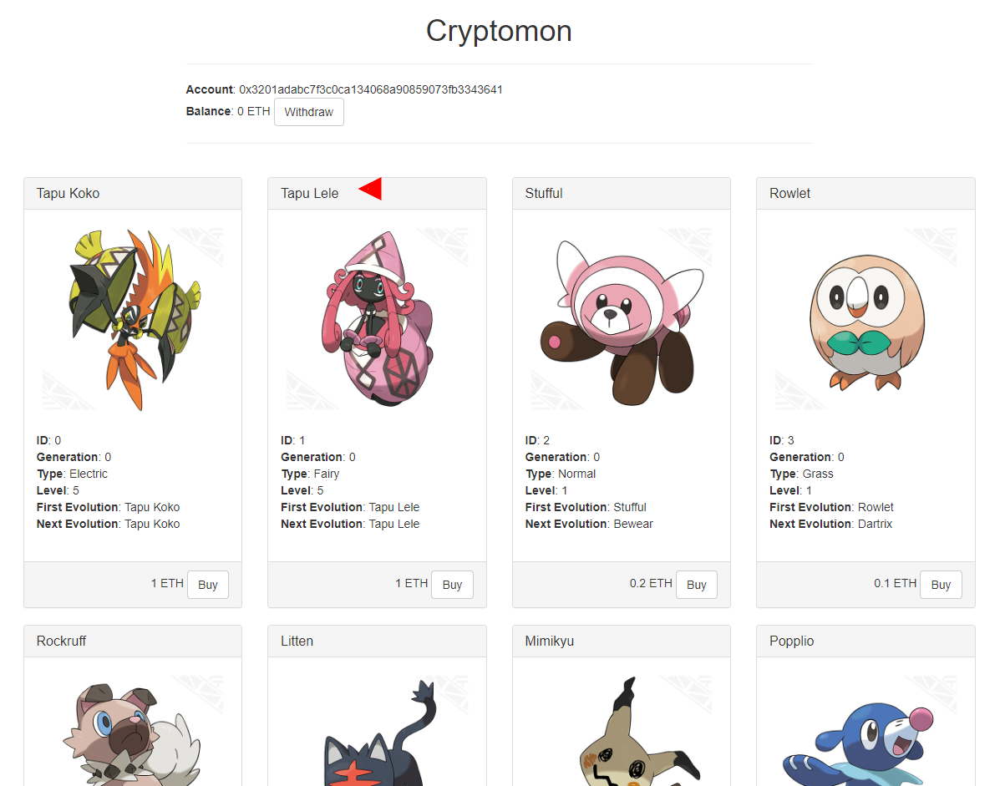

All Pokemon cards are listed with an option to buy, if they are for sale.

If they click on the Buy button, the app contacts their Ethereum wallet, in this example Metamask:

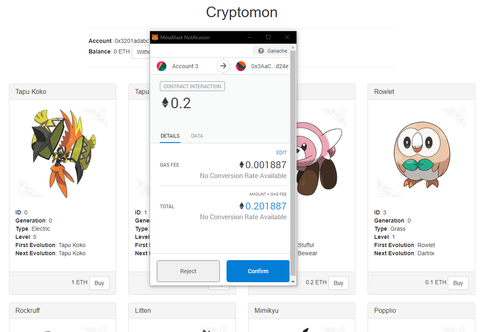

If they choose to sign this transaction, it is sent to the smart contract and the page refreshes.

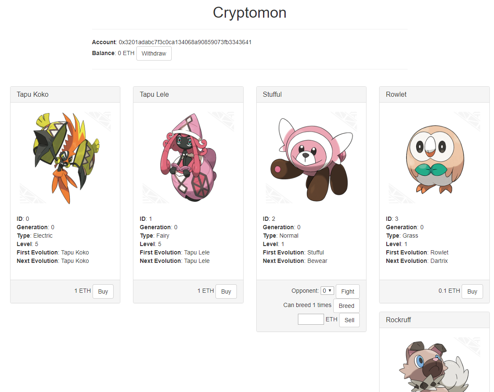

### Selling Pokemon

Users can enter a price in ETH and list a Pokemon card for sale.

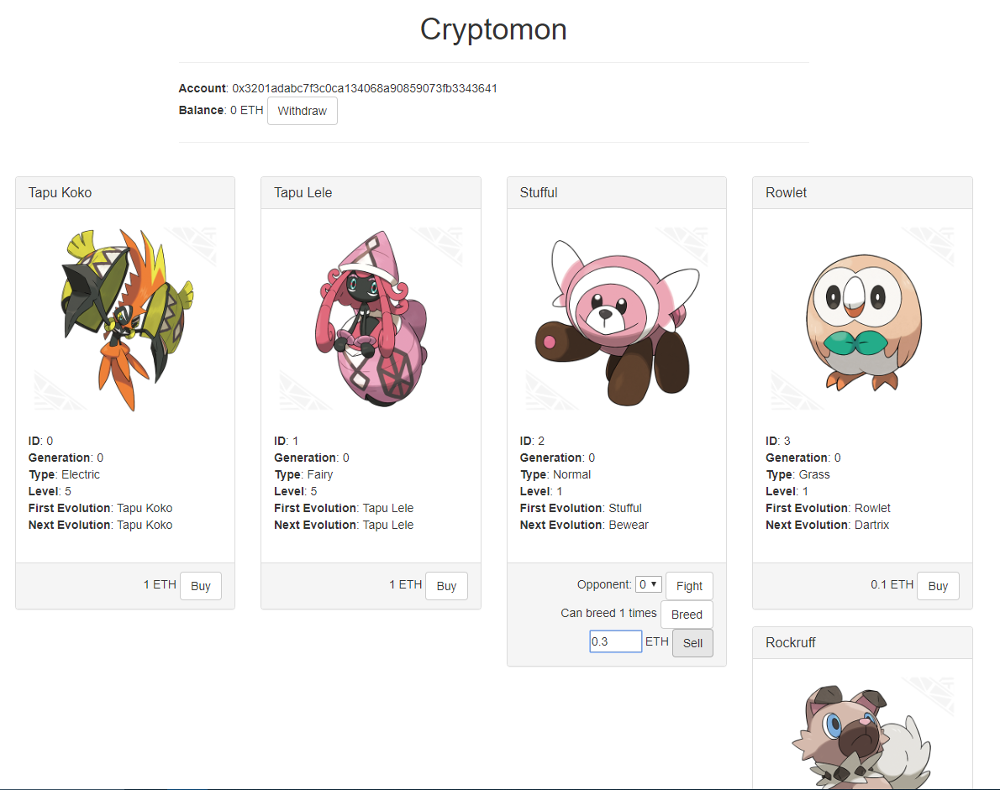

The user is prompted to sign the transaction:

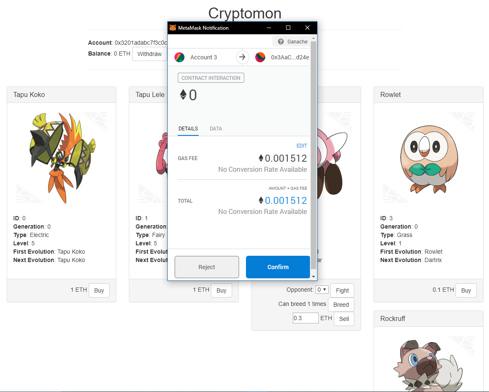

If they sign it, the card is listed for sale.

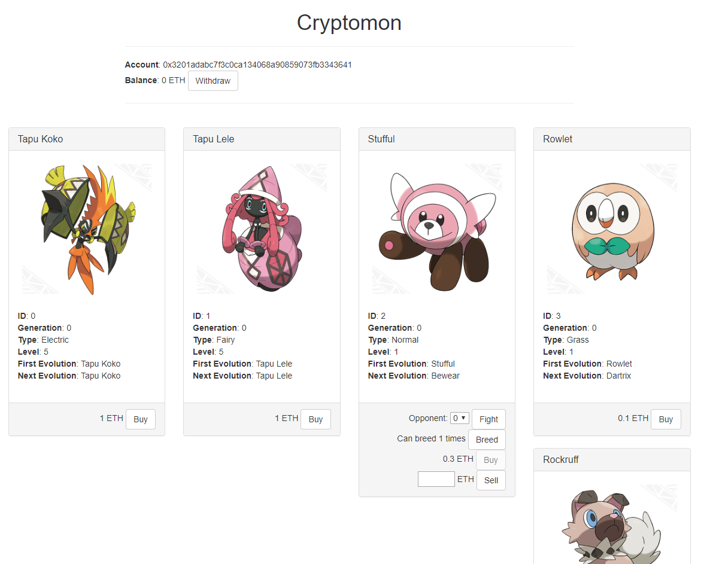

Once another user buys this card, the price is added to the original owner's balance, and they can withdraw the Ether by clicking on Withdraw at the top.

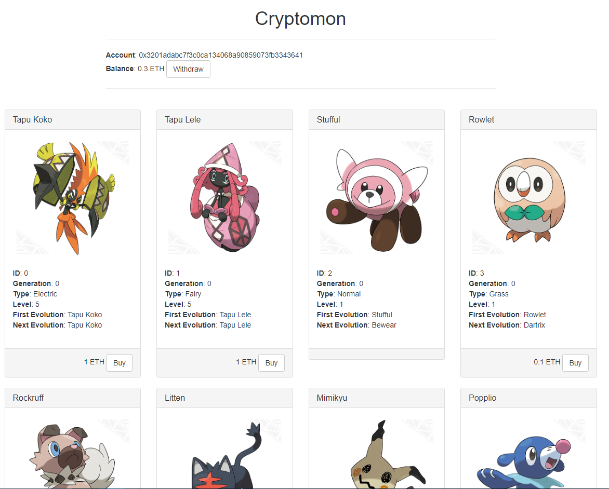

### Fighting Pokemon

Users can start a fight with any Pokemon they own.

They can only attack Pokemon which are not stunned.

The winner of fights is picked randomly using a RNG. The attacker's probability of winning is greater if they have a higher _Level_ than the defender, and vice versa. A Level 5 card will always win against a Level 1 card and a Level 1 card will always lose against a Level 5 card.

### Reviving Pokemon

A Pokemon card which loses a fight, whether as an attacker or a defender, is _stunned_ and gains Revive option.

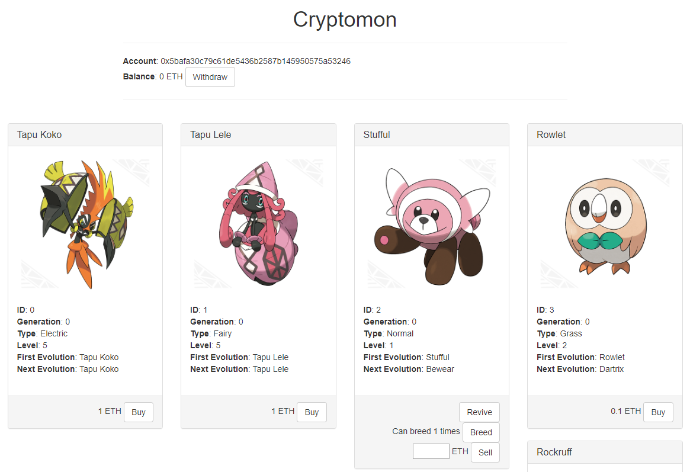

Reviving costs a fee of 0.01 ETH which is added to the balance of the game admin.

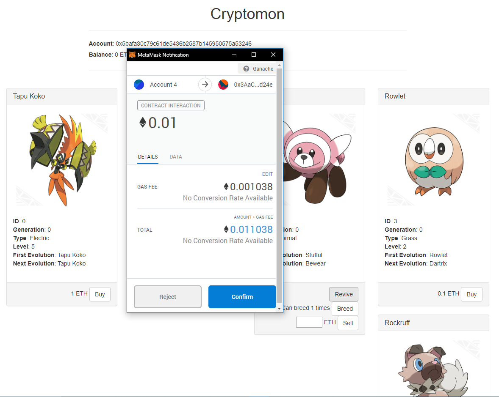

### Evolving Pokemon

A Pokemon card which wins a fight, whether as an attacker or a defender, gains one level up and gains the Evolve option.

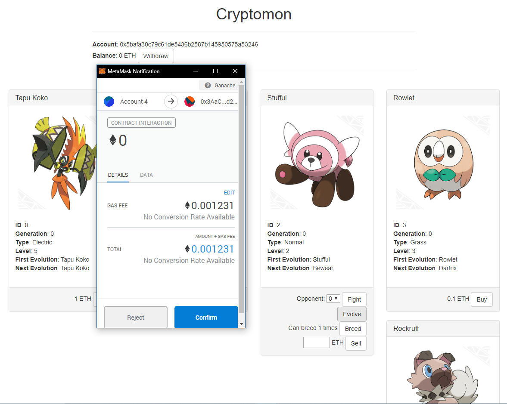

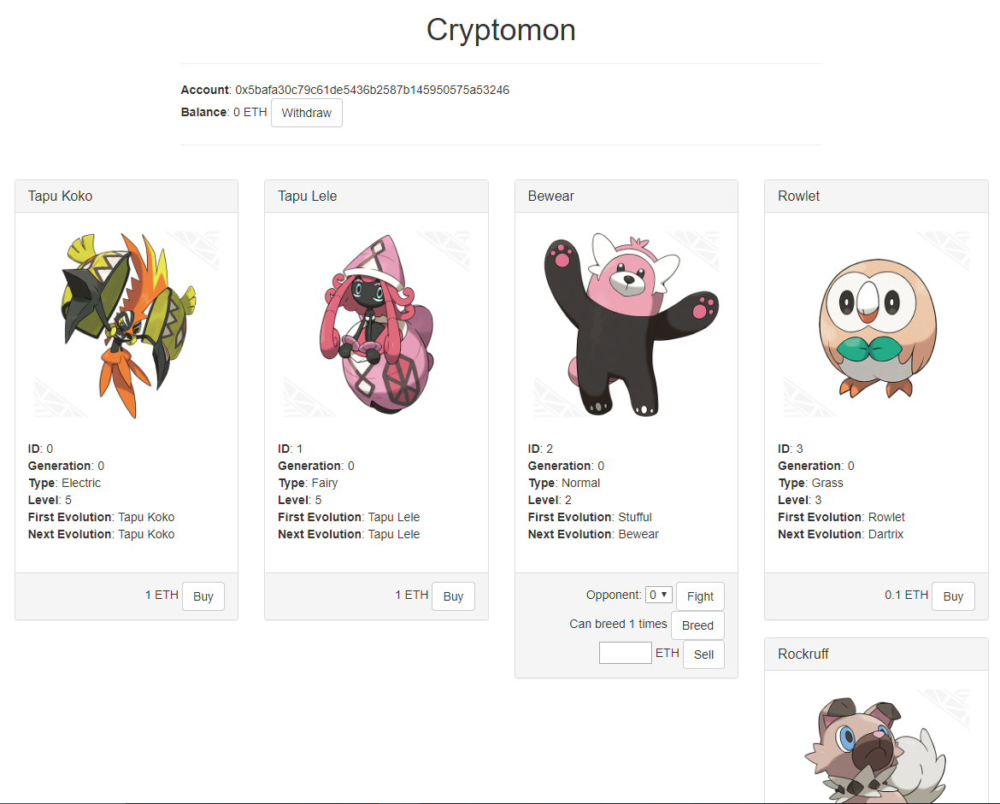

Evolving will revive a stunned Pokemon.

### Breeding Pokemon

Each Pokemon card can breed a certain amount of times, except some species such as Tapu Koko.

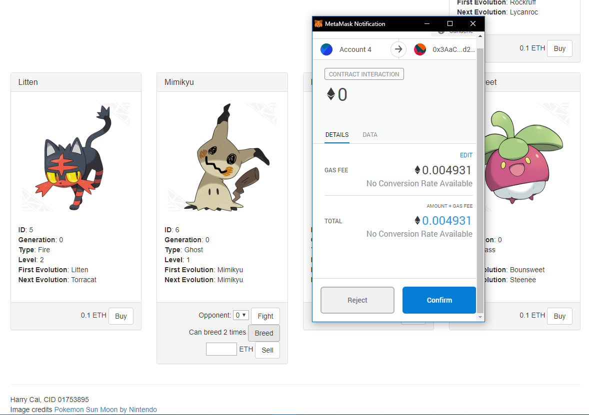

The owner of a Pokemon card can use it to breed more cards. The 'children' of a Pokemon have a higher generation number, and start at level 1 and take the first evolution of that species.

Lower generation numbers are therefore rarer cards. The owner of a Pokemon card can breed infinitely many more cards, but can only breed a maximum number of each generation, and cannot breed any with the same or lower generation number as their original.

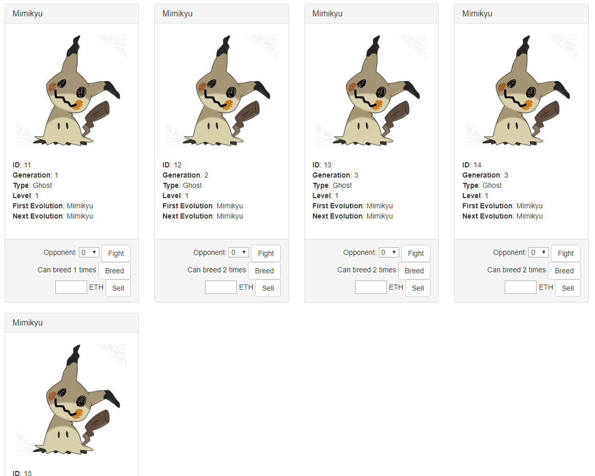


### Admin Functions

The contract has a couple of functions for admin use only, such as `defineSpecies()` and `addPokemon()`. These are not included in the UI and the Admin would have to call these using eg. the truffle console.

For example, to define and add a card for a Tapu Bulu, the admin might open up a truffle console:

```
truffle console
```

And call the necessary contract functions:

```
let crt = await Cryptomon.deployed();
await crt.defineSpecies(20, 3, 20, 20);
await crt.addPokemon(20, web3.toWei(1, 'ether'), true, 5);
```

These transactions would need to be sent from the Admin address.

Next the game admin would update the UI to be able to render the new card (images and text are not stored on the blockchain!), and roll out the updated UI to users.

## Security considerations

### RNG

Random numbers are generated using the hash of the block timestamp and block difficulty (see `Cryptomon._random()`).

A miner could exploit this to make sure they win all their battles: they could include a fight transaction in only their local copy (ie. not broadcast this fight transaction), and then if they obtain a valid block, only broadcast this block if they won that fight.

However, it would not make economic sense for them to do this. By using the above exploit they can win all their battles and avoid paying the revive fees for losing, but they stand to make far more Ether from mining and publishing all blocks immediately.

In summary, as long as the revive fees are very small in comparison to mining block rewards, the RNG cannot be exploited by an rational miner agent.

### Withdrawal pattern

When a user buys a Pokemon card, they send their Ether to the smart contract.

Instead of sending the Ether to the original owner straightaway, the smart contract keeps track of how much Ether the original owner is owed, and the original owner must call the smart contract to withdraw this Ether.

This is known as the Withdrawal Pattern and prevents attackers from trapping the contract in an unusable state, eg. by calling the smart contract via another smart contract whose fallback function always fails.[*](https://solidity.readthedocs.io/en/v0.4.24/common-patterns.html#withdrawal-from-contracts)

### Preventing re-entrancy

Suppose an attacker creates a smart contract which calls into the Cryptomon contract, and tries a re-entrancy attack:

1. It buys a card
2. It lists the card up for sale and waits for someone to buy it
3. Once the card is sold, it calls `withdrawFunds()` to withdraw from its Ether balance.
4. In its fallback function, it calls `withdrawFunds()` again, in the hope of withdrawing the same balance infinitely many times.

This attack would not work because the Cryptomon contract sets the attacker's pending balance to zero **before** sending Ether to the attacker. So the attacker would only be sent its pending balance once, and then waste gas fees repeatedly calling `withdrawFunds()` to no effect.